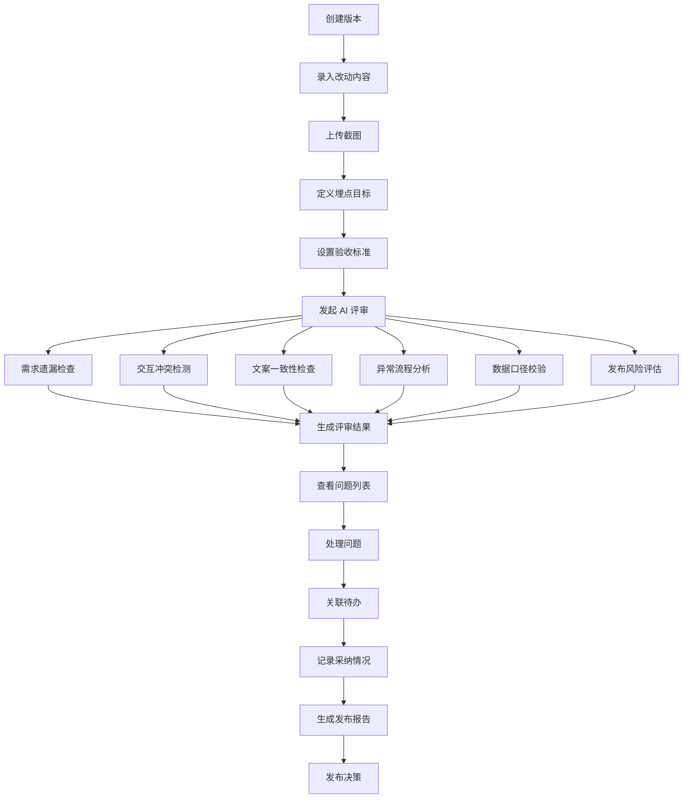
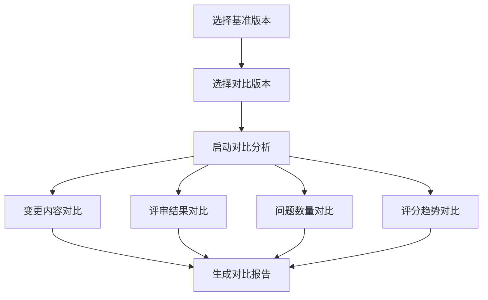
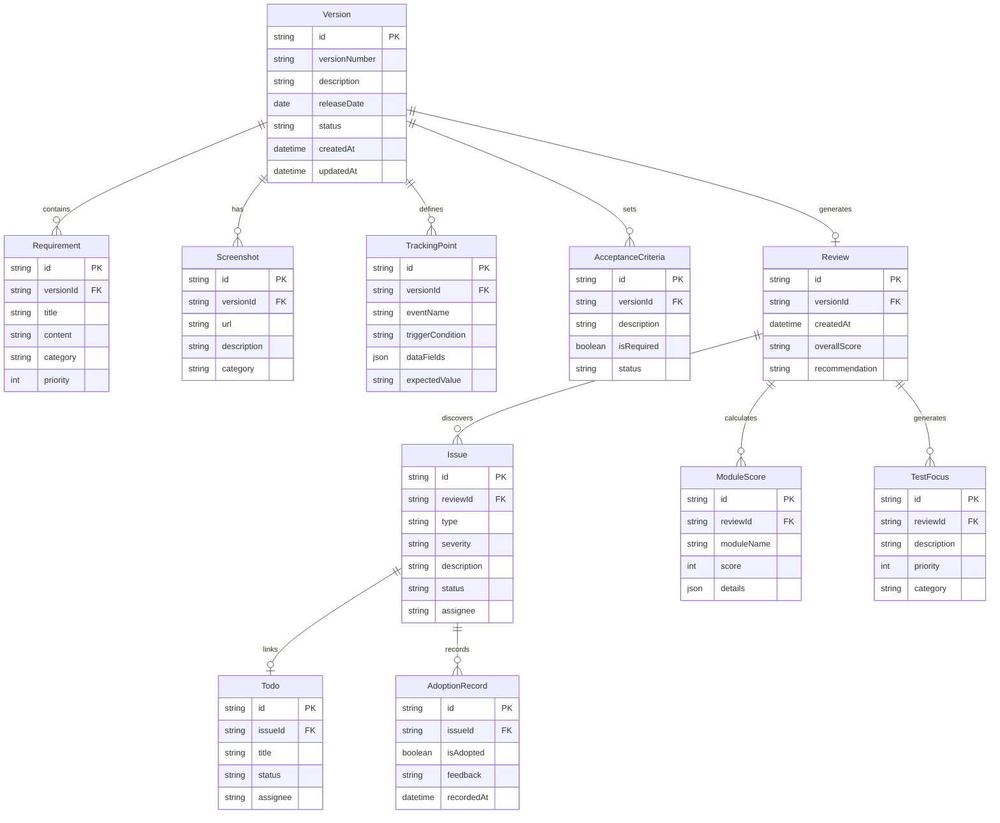

# AI 版本评审助手 - 产品需求文档

## 1. 产品概述

AI 版本评审助手是一款面向移动 App 和网页产品迭代验收的智能评审工具。通过 AI 驱动的自动化检查，帮助产品团队在发布前发现需求遗漏、交互冲突、文案不一致等问题，提升版本发布质量和效率。

**核心价值**：
- 降低版本发布风险，减少线上问题
- 提升评审效率，自动化检查替代人工逐项核对
- 建立版本质量档案，支持历史追溯和对比分析

## 2. 核心功能

### 2.1 用户角色

| 角色 | 注册方式 | 核心权限 |
|------|----------|----------|
| 产品经理 | 邀请注册 | 创建版本、录入需求、发起评审、查看报告 |
| 测试工程师 | 邀请注册 | 查看评审结果、关联问题、跟踪修复状态 |
| 项目负责人 | 邀请注册 | 查看发布建议、审批发布决策 |

### 2.2 功能模块

1. **版本空间**：版本列表、版本创建、版本对比、版本归档
2. **需求清单**：需求录入、截图上传、埋点定义、验收标准设置
3. **AI 评审页**：智能检查、模块评分、问题发现、测试关注点生成
4. **问题跟踪页**：问题列表、状态流转、关联待办、采纳记录
5. **发布建议页**：评审报告、风险汇总、发布决策、历史对比

### 2.3 页面详情

| 页面名称 | 模块名称 | 功能描述 |
|----------|----------|----------|
| 版本空间 | 版本列表 | 展示所有版本卡片，包含版本号、状态、创建时间、评审进度 |
| 版本空间 | 版本创建 | 创建新版本，填写版本号、发布日期、版本描述、关联需求 |
| 版本空间 | 版本对比 | 选择两个版本进行差异对比，展示变更内容和评审结果差异 |
| 需求清单 | 改动录入 | 录入本次版本的功能改动，支持富文本和 Markdown 格式 |
| 需求清单 | 截图管理 | 上传功能截图、交互流程图，支持标注和分类 |
| 需求清单 | 埋点定义 | 定义埋点事件名称、触发条件、数据字段、期望值 |
| 需求清单 | 验收标准 | 设置功能验收标准，支持预设模板和自定义条件 |
| AI 评审页 | 需求遗漏检查 | AI 分析需求文档与改动内容，识别可能遗漏的需求点 |
| AI 评审页 | 交互冲突检测 | 检测新旧功能间的交互冲突，识别用户体验不一致问题 |
| AI 评审页 | 文案一致性检查 | 检查界面文案、提示语、错误信息的统一性 |
| AI 评审页 | 异常流程分析 | 分析异常场景处理是否完善，边界条件是否覆盖 |
| AI 评审页 | 数据口径校验 | 校验埋点定义与业务逻辑的一致性，数据字段完整性 |
| AI 评审页 | 发布风险评估 | 综合评估发布风险，识别潜在问题和依赖风险 |
| AI 评审页 | 模块评分 | 按功能模块给出质量评分，展示评分雷达图 |
| AI 评审页 | 测试关注点 | 自动生成测试重点清单，按优先级排序 |
| 问题跟踪页 | 问题列表 | 展示 AI 发现的所有问题，支持筛选、排序、搜索 |
| 问题跟踪页 | 状态流转 | 问题状态管理：待处理→处理中→已解决→已验证→已关闭 |
| 问题跟踪页 | 关联待办 | 将问题关联到团队待办事项，支持导出到项目管理工具 |
| 问题跟踪页 | 采纳记录 | 记录用户对 AI 建议的采纳情况，支持反馈和备注 |
| 发布建议页 | 评审报告 | 生成完整的版本评审报告，包含各项检查结果和评分 |
| 发布建议页 | 风险汇总 | 汇总发布风险，按严重程度分类展示 |
| 发布建议页 | 发布决策 | 提供发布建议（建议发布/有条件发布/不建议发布） |
| 发布建议页 | 历史对比 | 与历史版本对比，展示质量趋势和改进情况 |

## 3. 核心流程

### 3.1 版本评审主流程

用户创建版本后，录入本次改动内容、截图、埋点目标和验收标准。系统自动触发 AI 评审，检查需求遗漏、交互冲突、文案一致性等问题。评审完成后，用户查看问题列表，处理并关联待办事项。最终生成发布评审报告，辅助发布决策。

### 3.2 版本对比流程

## 4. 用户界面设计

### 4.1 设计风格

**主题定位**：专业、高效、智能的评审工具

**色彩方案**：
- 主色调：深蓝 `#1E3A5F` - 专业、可信赖
- 辅助色：青色 `#00B4D8` - 科技感、活力
- 警告色：橙色 `#FF9500` - 需要关注
- 错误色：红色 `#E63946` - 严重问题
- 成功色：绿色 `#2ECC71` - 通过验证
- 背景色：浅灰 `#F8FAFC` - 清爽、护眼

**字体方案**：
- 标题字体：Source Sans Pro - 专业、现代
- 正文字体：Inter - 清晰、易读
- 代码字体：JetBrains Mono - 技术感

**布局风格**：
- 左侧固定导航栏
- 顶部工具栏
- 内容区卡片式布局
- 响应式网格系统

**按钮样式**：
- 主按钮：填充色 + 圆角 + 悬停渐变
- 次按钮：描边 + 圆角 + 悬停填充
- 图标按钮：圆形 + 悬停阴影

### 4.2 页面设计概览

| 页面名称 | 模块名称 | UI 元素 |
|----------|----------|----------|
| 版本空间 | 版本列表 | 卡片网格布局，每个卡片含版本号徽章、状态标签、进度条、操作按钮 |
| 版本空间 | 版本创建 | 模态框表单，包含输入框、日期选择器、富文本编辑器 |
| 版本空间 | 版本对比 | 双栏对比布局，差异高亮显示，变更统计面板 |
| 需求清单 | 改动录入 | 分栏布局，左侧目录树，右侧富文本编辑区 |
| 需求清单 | 截图管理 | 网格相册布局，支持拖拽排序、点击预览、标注工具 |
| 需求清单 | 埋点定义 | 表格布局，支持内联编辑、批量导入、模板选择 |
| 需求清单 | 验收标准 | 检查清单样式，支持勾选、优先级标记、负责人分配 |
| AI 评审页 | 检查结果 | 选项卡切换不同检查维度，每个检查项含状态图标、描述、详情展开 |
| AI 评审页 | 模块评分 | 雷达图可视化，评分卡片，趋势折线图 |
| AI 评审页 | 测试关注点 | 优先级排序列表，标签分类，负责人分配 |
| 问题跟踪页 | 问题列表 | 表格布局，状态筛选器，严重程度标签，搜索框 |
| 问题跟踪页 | 问题详情 | 侧边抽屉，问题描述、关联需求、处理记录、评论 |
| 发布建议页 | 评审报告 | 报告预览区，导出按钮，分享链接 |
| 发布建议页 | 风险汇总 | 风险矩阵图，严重程度分布饼图 |
| 发布建议页 | 发布决策 | 决策卡片，建议标签，审批按钮，历史记录 |

### 4.3 响应式设计

- **桌面优先**：主要面向桌面端使用，支持 1440px 及以上分辨率
- **移动适配**：支持平板端查看，关键功能可操作
- **触控优化**：按钮和交互区域保持足够的触控面积

### 4.4 动效设计

- **页面切换**：淡入淡出 + 轻微位移
- **卡片悬停**：阴影加深 + 轻微上浮
- **按钮点击**：涟漪效果 + 缩放反馈
- **加载状态**：骨架屏 + 渐进式加载
- **评审进度**：进度条动画 + 数字跳动

## 5. 数据模型

### 5.1 核心实体

## 6. 非功能性需求

### 6.1 性能要求
- 页面首次加载时间 < 3 秒
- AI 评审响应时间 < 30 秒
- 支持同时处理 100+ 个版本数据

### 6.2 安全要求
- 用户身份认证和授权
- 数据传输加密
- 敏感信息脱敏存储

### 6.3 可用性要求
- 系统可用性 > 99.5%
- 支持数据导出和备份
- 操作日志记录

## 7. 后续规划

### 第一阶段（当前）
- 基础版本管理
- AI 评审核心功能
- 问题跟踪和发布建议

### 第二阶段
- 集成主流项目管理工具（Jira、飞书等）
- 支持团队协作和评论
- 自定义评审规则

### 第三阶段
- 历史数据分析
- 质量趋势预测
- 智能推荐优化