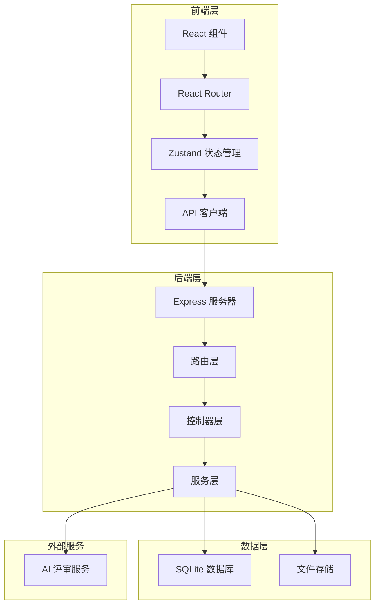
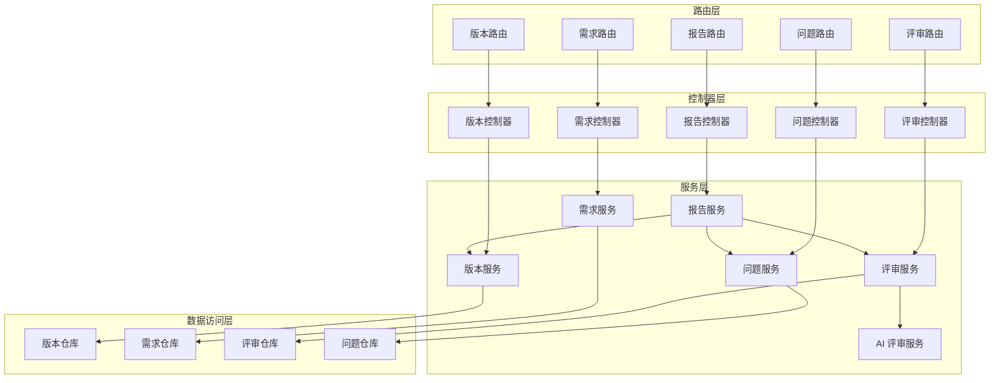

# AI 版本评审助手 - 技术架构文档

## 1. 架构设计



## 2. 技术选型

### 2.1 前端技术栈
- **框架**: React 18 + TypeScript
- **构建工具**: Vite
- **样式方案**: Tailwind CSS
- **状态管理**: Zustand
- **路由**: React Router DOM
- **图表库**: Recharts（雷达图、趋势图）
- **图标**: Lucide React
- **富文本编辑**: TipTap

### 2.2 后端技术栈
- **运行时**: Node.js
- **框架**: Express + TypeScript
- **数据库**: SQLite（轻量级，无需额外安装）
- **文件存储**: 本地文件系统

### 2.3 开发工具
- **包管理器**: npm
- **代码规范**: ESLint + Prettier
- **类型检查**: TypeScript

## 3. 路由定义

| 路由路径 | 页面名称 | 功能描述 |
|----------|----------|----------|
| `/` | 首页 | 重定向到版本空间 |
| `/versions` | 版本空间 | 版本列表、创建、对比 |
| `/versions/:id` | 版本详情 | 版本概览、快捷操作入口 |
| `/versions/:id/requirements` | 需求清单 | 改动录入、截图、埋点、验收标准 |
| `/versions/:id/review` | AI 评审页 | 评审结果、模块评分、测试关注点 |
| `/versions/:id/issues` | 问题跟踪页 | 问题列表、状态管理、关联待办 |
| `/versions/:id/report` | 发布建议页 | 评审报告、风险汇总、发布决策 |

## 4. API 定义

### 4.1 版本管理 API

```typescript
// 版本列表
GET /api/versions
Response: {
  versions: Version[];
  total: number;
}

// 创建版本
POST /api/versions
Body: {
  versionNumber: string;
  description: string;
  releaseDate: string;
}
Response: Version

// 获取版本详情
GET /api/versions/:id
Response: Version

// 更新版本
PUT /api/versions/:id
Body: Partial<Version>
Response: Version

// 删除版本
DELETE /api/versions/:id
Response: { success: boolean }

// 版本对比
GET /api/versions/compare?baseId=xxx&targetId=xxx
Response: {
  changes: Change[];
  summary: CompareSummary;
}
```

### 4.2 需求管理 API

```typescript
// 获取需求列表
GET /api/versions/:versionId/requirements
Response: Requirement[]

// 创建需求
POST /api/versions/:versionId/requirements
Body: {
  title: string;
  content: string;
  category: string;
  priority: number;
}
Response: Requirement

// 更新需求
PUT /api/requirements/:id
Body: Partial<Requirement>
Response: Requirement

// 删除需求
DELETE /api/requirements/:id
Response: { success: boolean }
```

### 4.3 截图管理 API

```typescript
// 获取截图列表
GET /api/versions/:versionId/screenshots
Response: Screenshot[]

// 上传截图
POST /api/versions/:versionId/screenshots
Body: FormData (file, description, category)
Response: Screenshot

// 删除截图
DELETE /api/screenshots/:id
Response: { success: boolean }
```

### 4.4 埋点管理 API

```typescript
// 获取埋点列表
GET /api/versions/:versionId/tracking-points
Response: TrackingPoint[]

// 创建埋点
POST /api/versions/:versionId/tracking-points
Body: {
  eventName: string;
  triggerCondition: string;
  dataFields: object;
  expectedValue: string;
}
Response: TrackingPoint

// 更新埋点
PUT /api/tracking-points/:id
Body: Partial<TrackingPoint>
Response: TrackingPoint

// 删除埋点
DELETE /api/tracking-points/:id
Response: { success: boolean }
```

### 4.5 验收标准 API

```typescript
// 获取验收标准列表
GET /api/versions/:versionId/acceptance-criteria
Response: AcceptanceCriteria[]

// 创建验收标准
POST /api/versions/:versionId/acceptance-criteria
Body: {
  description: string;
  isRequired: boolean;
}
Response: AcceptanceCriteria

// 更新验收标准状态
PUT /api/acceptance-criteria/:id/status
Body: { status: 'pending' | 'passed' | 'failed' }
Response: AcceptanceCriteria
```

### 4.6 评审 API

```typescript
// 发起评审
POST /api/versions/:versionId/reviews
Response: {
  reviewId: string;
  status: 'processing';
}

// 获取评审结果
GET /api/reviews/:reviewId
Response: Review

// 获取模块评分
GET /api/reviews/:reviewId/module-scores
Response: ModuleScore[]

// 获取测试关注点
GET /api/reviews/:reviewId/test-focuses
Response: TestFocus[]
```

### 4.7 问题管理 API

```typescript
// 获取问题列表
GET /api/reviews/:reviewId/issues
Query: { status?: string; severity?: string; type?: string }
Response: Issue[]

// 更新问题状态
PUT /api/issues/:id/status
Body: { status: string; assignee?: string }
Response: Issue

// 关联待办
POST /api/issues/:id/todos
Body: { title: string; assignee: string }
Response: Todo

// 记录采纳情况
POST /api/issues/:id/adoption
Body: { isAdopted: boolean; feedback?: string }
Response: AdoptionRecord
```

### 4.8 报告 API

```typescript
// 生成评审报告
GET /api/versions/:versionId/report
Response: ReviewReport

// 导出报告
GET /api/versions/:versionId/report/export?format=pdf|markdown
Response: File
```

## 5. 数据模型定义

### 5.1 TypeScript 类型定义

```typescript
// 版本状态
type VersionStatus = 'draft' | 'reviewing' | 'approved' | 'rejected' | 'released';

// 问题类型
type IssueType = 'requirement_missing' | 'interaction_conflict' | 'text_inconsistency' | 'exception_flow' | 'data_mismatch' | 'release_risk';

// 问题严重程度
type IssueSeverity = 'critical' | 'high' | 'medium' | 'low';

// 问题状态
type IssueStatus = 'open' | 'in_progress' | 'resolved' | 'verified' | 'closed';

// 发布建议
type ReleaseRecommendation = 'recommend' | 'conditional' | 'not_recommend';

// 版本
interface Version {
  id: string;
  versionNumber: string;
  description: string;
  releaseDate: string;
  status: VersionStatus;
  createdAt: string;
  updatedAt: string;
}

// 需求
interface Requirement {
  id: string;
  versionId: string;
  title: string;
  content: string;
  category: string;
  priority: number;
  createdAt: string;
}

// 截图
interface Screenshot {
  id: string;
  versionId: string;
  url: string;
  description: string;
  category: string;
  createdAt: string;
}

// 埋点
interface TrackingPoint {
  id: string;
  versionId: string;
  eventName: string;
  triggerCondition: string;
  dataFields: Record<string, string>;
  expectedValue: string;
  createdAt: string;
}

// 验收标准
interface AcceptanceCriteria {
  id: string;
  versionId: string;
  description: string;
  isRequired: boolean;
  status: 'pending' | 'passed' | 'failed';
  createdAt: string;
}

// 评审
interface Review {
  id: string;
  versionId: string;
  createdAt: string;
  overallScore: number;
  recommendation: ReleaseRecommendation;
  summary: string;
}

// 问题
interface Issue {
  id: string;
  reviewId: string;
  type: IssueType;
  severity: IssueSeverity;
  title: string;
  description: string;
  suggestion: string;
  status: IssueStatus;
  assignee?: string;
  createdAt: string;
  updatedAt: string;
}

// 模块评分
interface ModuleScore {
  id: string;
  reviewId: string;
  moduleName: string;
  score: number;
  maxScore: number;
  details: {
    criterion: string;
    score: number;
    weight: number;
  }[];
}

// 测试关注点
interface TestFocus {
  id: string;
  reviewId: string;
  description: string;
  priority: number;
  category: string;
  relatedIssues: string[];
}

// 待办
interface Todo {
  id: string;
  issueId: string;
  title: string;
  status: 'pending' | 'in_progress' | 'completed';
  assignee?: string;
  dueDate?: string;
  createdAt: string;
}

// 采纳记录
interface AdoptionRecord {
  id: string;
  issueId: string;
  isAdopted: boolean;
  feedback?: string;
  recordedAt: string;
}

// 评审报告
interface ReviewReport {
  version: Version;
  review: Review;
  moduleScores: ModuleScore[];
  issues: Issue[];
  testFocuses: TestFocus[];
  riskSummary: {
    critical: number;
    high: number;
    medium: number;
    low: number;
  };
  comparison?: {
    previousVersion: Version;
    scoreChange: number;
    issueCountChange: number;
  };
}
```

## 6. 服务端架构



## 7. 数据库设计

### 7.1 表结构

```sql
-- 版本表
CREATE TABLE versions (
  id TEXT PRIMARY KEY,
  version_number TEXT NOT NULL UNIQUE,
  description TEXT,
  release_date TEXT,
  status TEXT DEFAULT 'draft',
  created_at TEXT DEFAULT CURRENT_TIMESTAMP,
  updated_at TEXT DEFAULT CURRENT_TIMESTAMP
);

-- 需求表
CREATE TABLE requirements (
  id TEXT PRIMARY KEY,
  version_id TEXT NOT NULL,
  title TEXT NOT NULL,
  content TEXT,
  category TEXT,
  priority INTEGER DEFAULT 0,
  created_at TEXT DEFAULT CURRENT_TIMESTAMP,
  FOREIGN KEY (version_id) REFERENCES versions(id) ON DELETE CASCADE
);

-- 截图表
CREATE TABLE screenshots (
  id TEXT PRIMARY KEY,
  version_id TEXT NOT NULL,
  url TEXT NOT NULL,
  description TEXT,
  category TEXT,
  created_at TEXT DEFAULT CURRENT_TIMESTAMP,
  FOREIGN KEY (version_id) REFERENCES versions(id) ON DELETE CASCADE
);

-- 埋点表
CREATE TABLE tracking_points (
  id TEXT PRIMARY KEY,
  version_id TEXT NOT NULL,
  event_name TEXT NOT NULL,
  trigger_condition TEXT,
  data_fields TEXT,
  expected_value TEXT,
  created_at TEXT DEFAULT CURRENT_TIMESTAMP,
  FOREIGN KEY (version_id) REFERENCES versions(id) ON DELETE CASCADE
);

-- 验收标准表
CREATE TABLE acceptance_criteria (
  id TEXT PRIMARY KEY,
  version_id TEXT NOT NULL,
  description TEXT NOT NULL,
  is_required INTEGER DEFAULT 1,
  status TEXT DEFAULT 'pending',
  created_at TEXT DEFAULT CURRENT_TIMESTAMP,
  FOREIGN KEY (version_id) REFERENCES versions(id) ON DELETE CASCADE
);

-- 评审表
CREATE TABLE reviews (
  id TEXT PRIMARY KEY,
  version_id TEXT NOT NULL,
  overall_score REAL,
  recommendation TEXT,
  summary TEXT,
  created_at TEXT DEFAULT CURRENT_TIMESTAMP,
  FOREIGN KEY (version_id) REFERENCES versions(id) ON DELETE CASCADE
);

-- 问题表
CREATE TABLE issues (
  id TEXT PRIMARY KEY,
  review_id TEXT NOT NULL,
  type TEXT NOT NULL,
  severity TEXT NOT NULL,
  title TEXT NOT NULL,
  description TEXT,
  suggestion TEXT,
  status TEXT DEFAULT 'open',
  assignee TEXT,
  created_at TEXT DEFAULT CURRENT_TIMESTAMP,
  updated_at TEXT DEFAULT CURRENT_TIMESTAMP,
  FOREIGN KEY (review_id) REFERENCES reviews(id) ON DELETE CASCADE
);

-- 模块评分表
CREATE TABLE module_scores (
  id TEXT PRIMARY KEY,
  review_id TEXT NOT NULL,
  module_name TEXT NOT NULL,
  score REAL NOT NULL,
  max_score REAL DEFAULT 100,
  details TEXT,
  FOREIGN KEY (review_id) REFERENCES reviews(id) ON DELETE CASCADE
);

-- 测试关注点表
CREATE TABLE test_focuses (
  id TEXT PRIMARY KEY,
  review_id TEXT NOT NULL,
  description TEXT NOT NULL,
  priority INTEGER DEFAULT 0,
  category TEXT,
  related_issues TEXT,
  FOREIGN KEY (review_id) REFERENCES reviews(id) ON DELETE CASCADE
);

-- 待办表
CREATE TABLE todos (
  id TEXT PRIMARY KEY,
  issue_id TEXT NOT NULL,
  title TEXT NOT NULL,
  status TEXT DEFAULT 'pending',
  assignee TEXT,
  due_date TEXT,
  created_at TEXT DEFAULT CURRENT_TIMESTAMP,
  FOREIGN KEY (issue_id) REFERENCES issues(id) ON DELETE CASCADE
);

-- 采纳记录表
CREATE TABLE adoption_records (
  id TEXT PRIMARY KEY,
  issue_id TEXT NOT NULL,
  is_adopted INTEGER NOT NULL,
  feedback TEXT,
  recorded_at TEXT DEFAULT CURRENT_TIMESTAMP,
  FOREIGN KEY (issue_id) REFERENCES issues(id) ON DELETE CASCADE
);

-- 索引
CREATE INDEX idx_requirements_version ON requirements(version_id);
CREATE INDEX idx_screenshots_version ON screenshots(version_id);
CREATE INDEX idx_tracking_points_version ON tracking_points(version_id);
CREATE INDEX idx_acceptance_criteria_version ON acceptance_criteria(version_id);
CREATE INDEX idx_reviews_version ON reviews(version_id);
CREATE INDEX idx_issues_review ON issues(review_id);
CREATE INDEX idx_issues_status ON issues(status);
CREATE INDEX idx_issues_severity ON issues(severity);
CREATE INDEX idx_module_scores_review ON module_scores(review_id);
CREATE INDEX idx_test_focuses_review ON test_focuses(review_id);
CREATE INDEX idx_todos_issue ON todos(issue_id);
CREATE INDEX idx_adoption_records_issue ON adoption_records(issue_id);
```

## 8. 项目目录结构

```
project/
├── src/                          # 前端源码
│   ├── components/               # 公共组件
│   │   ├── ui/                   # 基础 UI 组件
│   │   │   ├── Button.tsx
│   │   │   ├── Card.tsx
│   │   │   ├── Modal.tsx
│   │   │   ├── Table.tsx
│   │   │   ├── Badge.tsx
│   │   │   ├── Progress.tsx
│   │   │   └── Tabs.tsx
│   │   ├── layout/               # 布局组件
│   │   │   ├── Sidebar.tsx
│   │   │   ├── Header.tsx
│   │   │   └── MainLayout.tsx
│   │   └── business/             # 业务组件
│   │       ├── VersionCard.tsx
│   │       ├── RequirementEditor.tsx
│   │       ├── ScreenshotUploader.tsx
│   │       ├── TrackingPointTable.tsx
│   │       ├── AcceptanceChecklist.tsx
│   │       ├── ReviewResultCard.tsx
│   │       ├── ModuleScoreRadar.tsx
│   │       ├── IssueTable.tsx
│   │       └── ReportPreview.tsx
│   ├── pages/                    # 页面组件
│   │   ├── Versions/             # 版本空间
│   │   │   ├── VersionList.tsx
│   │   │   ├── VersionCreate.tsx
│   │   │   └── VersionCompare.tsx
│   │   ├── Requirements/          # 需求清单
│   │   │   ├── RequirementEdit.tsx
│   │   │   ├── ScreenshotManage.tsx
│   │   │   ├── TrackingPointList.tsx
│   │   │   └── AcceptanceCriteria.tsx
│   │   ├── Review/               # AI 评审页
│   │   │   ├── ReviewResult.tsx
│   │   │   ├── ModuleScores.tsx
│   │   │   └── TestFocuses.tsx
│   │   ├── Issues/               # 问题跟踪页
│   │   │   ├── IssueList.tsx
│   │   │   └── IssueDetail.tsx
│   │   └── Report/               # 发布建议页
│   │       ├── ReportView.tsx
│   │       ├── RiskSummary.tsx
│   │       └── ReleaseDecision.tsx
│   ├── hooks/                    # 自定义 Hooks
│   │   ├── useVersions.ts
│   │   ├── useRequirements.ts
│   │   ├── useReview.ts
│   │   └── useIssues.ts
│   ├── store/                    # Zustand 状态管理
│   │   ├── versionStore.ts
│   │   ├── requirementStore.ts
│   │   ├── reviewStore.ts
│   │   └── issueStore.ts
│   ├── api/                      # API 客户端
│   │   ├── client.ts
│   │   ├── versions.ts
│   │   ├── requirements.ts
│   │   ├── reviews.ts
│   │   └── issues.ts
│   ├── types/                    # TypeScript 类型
│   │   └── index.ts
│   ├── utils/                    # 工具函数
│   │   ├── format.ts
│   │   └── validation.ts
│   ├── App.tsx                   # 根组件
│   ├── main.tsx                  # 入口文件
│   └── index.css                 # 全局样式
├── api/                          # 后端源码
│   ├── routes/                   # 路由
│   │   ├── versions.ts
│   │   ├── requirements.ts
│   │   ├── reviews.ts
│   │   ├── issues.ts
│   │   └── reports.ts
│   ├── controllers/              # 控制器
│   │   ├── versionController.ts
│   │   ├── requirementController.ts
│   │   ├── reviewController.ts
│   │   ├── issueController.ts
│   │   └── reportController.ts
│   ├── services/                 # 服务
│   │   ├── versionService.ts
│   │   ├── requirementService.ts
│   │   ├── reviewService.ts
│   │   ├── issueService.ts
│   │   ├── reportService.ts
│   │   └── aiService.ts
│   ├── repository/               # 数据访问
│   │   ├── versionRepo.ts
│   │   ├── requirementRepo.ts
│   │   ├── reviewRepo.ts
│   │   └── issueRepo.ts
│   ├── db/                       # 数据库
│   │   ├── database.ts
│   │   ├── migrations/
│   │   └── seeds/
│   ├── middleware/               # 中间件
│   │   └── errorHandler.ts
│   ├── types/                    # 类型定义
│   │   └── index.ts
│   └── server.ts                 # 服务入口
├── shared/                       # 共享类型
│   └── types.ts
├── public/                       # 静态资源
├── package.json
├── tsconfig.json
├── vite.config.ts
└── tailwind.config.js
```

## 9. AI 评审服务设计

### 9.1 评审维度

| 检查维度 | 检查内容 | 输出结果 |
|----------|----------|----------|
| 需求遗漏 | 分析需求文档与改动内容，识别遗漏点 | 遗漏项列表、影响评估 |
| 交互冲突 | 检测新旧功能间的交互冲突 | 冲突点、影响范围、建议方案 |
| 文案一致性 | 检查界面文案、提示语统一性 | 不一致项、建议文案 |
| 异常流程 | 分析异常场景处理完善度 | 缺失场景、处理建议 |
| 数据口径 | 校验埋点定义与业务逻辑一致性 | 数据问题、修正建议 |
| 发布风险 | 综合评估发布风险 | 风险等级、风险项、缓解措施 |

### 9.2 模块评分规则

```typescript
interface ScoringRule {
  dimension: string;
  weight: number;
  criteria: {
    name: string;
    maxScore: number;
    calculate: (data: any) => number;
  }[];
}

const scoringRules: ScoringRule[] = [
  {
    dimension: '需求完整性',
    weight: 0.25,
    criteria: [
      { name: '需求覆盖率', maxScore: 40, calculate: (data) => data.coverage * 40 },
      { name: '需求清晰度', maxScore: 30, calculate: (data) => data.clarity * 30 },
      { name: '验收标准完整性', maxScore: 30, calculate: (data) => data.criteria * 30 }
    ]
  },
  {
    dimension: '交互设计',
    weight: 0.20,
    criteria: [
      { name: '交互一致性', maxScore: 50, calculate: (data) => data.consistency * 50 },
      { name: '异常处理', maxScore: 30, calculate: (data) => data.exception * 30 },
      { name: '用户体验', maxScore: 20, calculate: (data) => data.ux * 20 }
    ]
  },
  {
    dimension: '文案规范',
    weight: 0.15,
    criteria: [
      { name: '文案统一性', maxScore: 60, calculate: (data) => data.uniformity * 60 },
      { name: '表述准确性', maxScore: 40, calculate: (data) => data.accuracy * 40 }
    ]
  },
  {
    dimension: '数据埋点',
    weight: 0.20,
    criteria: [
      { name: '埋点完整性', maxScore: 40, calculate: (data) => data.completeness * 40 },
      { name: '字段规范性', maxScore: 30, calculate: (data) => data.standard * 30 },
      { name: '数据一致性', maxScore: 30, calculate: (data) => data.consistency * 30 }
    ]
  },
  {
    dimension: '发布风险',
    weight: 0.20,
    criteria: [
      { name: '依赖稳定性', maxScore: 35, calculate: (data) => data.dependency * 35 },
      { name: '回滚可行性', maxScore: 35, calculate: (data) => data.rollback * 35 },
      { name: '监控完备性', maxScore: 30, calculate: (data) => data.monitoring * 30 }
    ]
  }
];
```

## 10. 开发计划

### 第一阶段：基础框架
- 项目初始化和依赖安装
- 数据库设计和初始化
- 基础 UI 组件开发
- 路由和状态管理配置

### 第二阶段：核心页面
- 版本空间页面
- 需求清单页面
- AI 评审页面
- 问题跟踪页面
- 发布建议页面

### 第三阶段：功能完善
- AI 评审服务集成
- 版本对比功能
- 报告导出功能
- 数据持久化

### 第四阶段：优化和测试
- 性能优化
- 用户体验优化
- 单元测试和集成测试